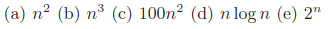

(1) 
**What value is returned by the following function? Express your answer as
a function of n. Give the worst-case running time using the Big Oh notation.**

```
Mystery(n)
    r = 0
    for i = 1 to n − 1 do
        for j = i + 1 to n do
            for k = 1 to j do
                r = r + 1
    return(r)
```
___
(2) 
**What value is returned by the following function? Express your answer as
a function of n. Give the worst-case running time using Big Oh notation.**

```
Pesky(n)
    r = 0
    for i = 1 to n do
        for j = 1 to i do
            for k = j to i + j do
                r = r + 1
    return(r)
```
___
(3) 
**What value is returned by the following function? Express your answer as
a function of n. Give the worst-case running time using Big Oh notation.**

```
Pestiferous(n)
    r = 0
    for i = 1 to n do
        for j = 1 to i do
            for k = j to i + j do
                for l = 1 to i + j − k do
                    r = r + 1
    return(r)
```
___
(4) 
**What value is returned by the following function? Express your answer as
a function of n. Give the worst-case running time using Big Oh notation.**

```
Conundrum(n)
    r = 0
    for i = 1 ton do
        for j = i + 1 to n do
            for k = i + j − 1 to n do
                r = r + 1
    return(r)
```
___
(5) 
**Consider the following algorithm: (the print operation prints a single aster-
isk; the operation x = 2x doubles the value of the variable x).**

```
for k = 1 to n:
    x = k
    while (x < n):
        print ’*’
        x = 2x
```
**Let f (n) be the time complexity of this algorithm (or equivalently the number
of times * is printed). Provide correct bounds for O(f (n)) and Ω(f (n)), ideally
converging on Θ(f (n)).**
___
(6) 

**Suppose the following algorithm is used to evaluate the polynomial**

```
p(x) = anxn + an−1xn−1 + . . . + a1x + a0
p = a0;
xpower = 1;
for i = 1 to n do
    xpower = x · xpower;
    p = p + ai ∗ xpower
```
(a)
**How many multiplications are done in the worst case? How many additions?**

(b)
**How many multiplications are done on the average?**

(c)
**Can you improve this algorithm?**
___
(15) 
**Suppose you have algorithms with the five running times listed below. (As-
sume these are the exact running times.) How much slower do each of these
algorithms get when you (a) double the input size, or (b) increase the input size
by one?**



(a) n2 (b) n3 (c) 100n2 (d) n log n (e) 2n
___
(16)
___
(30)
___
(37)
___
(49)
___
(50)
___
(53)
