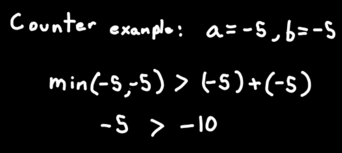
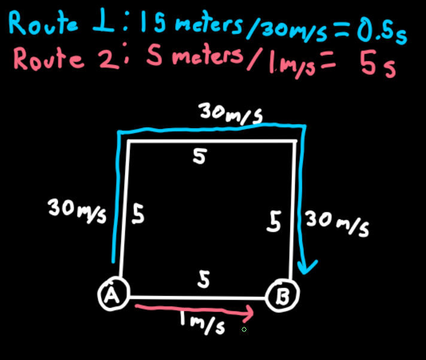
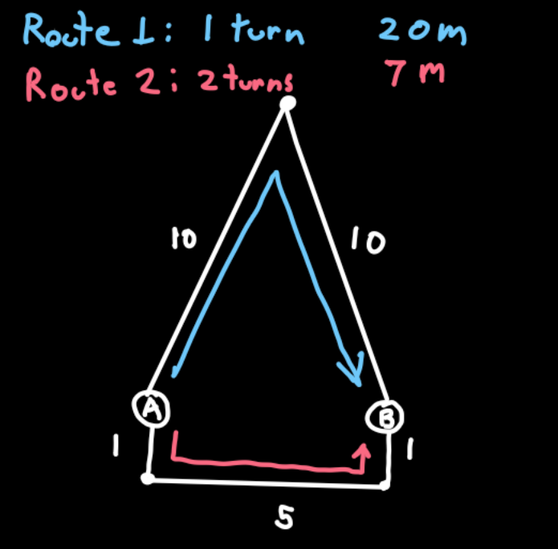
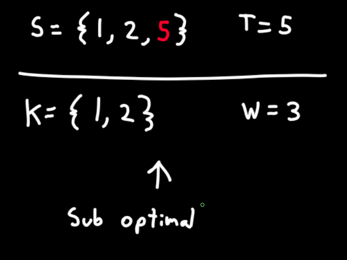
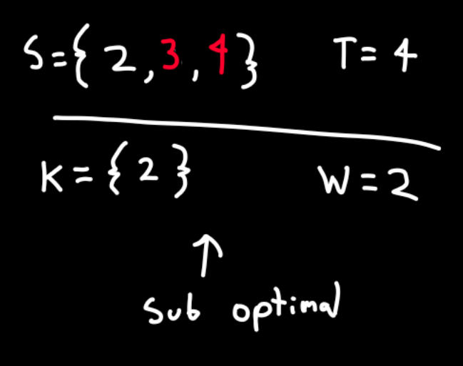
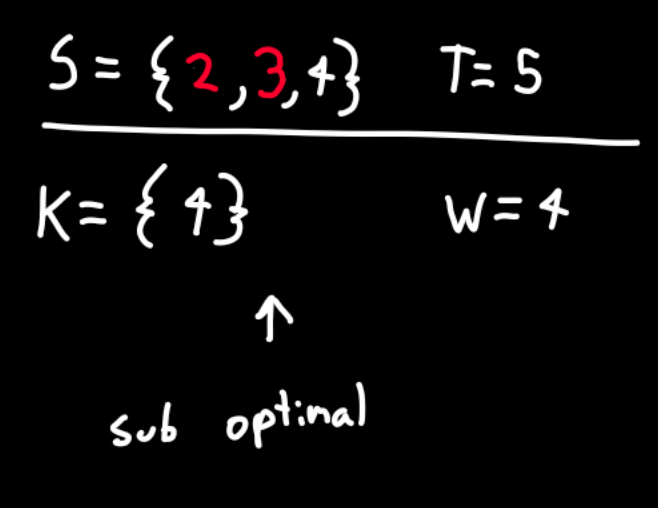
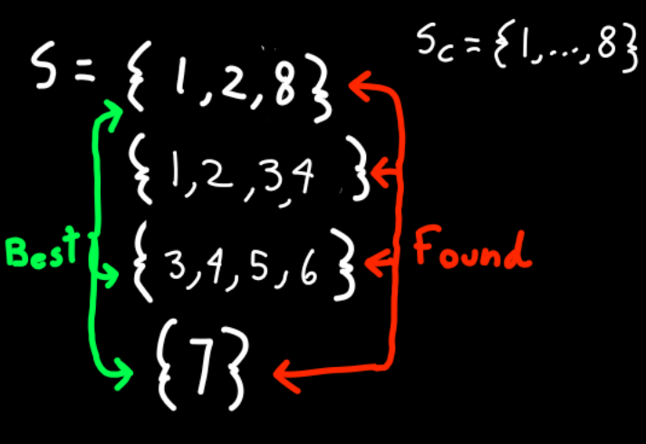
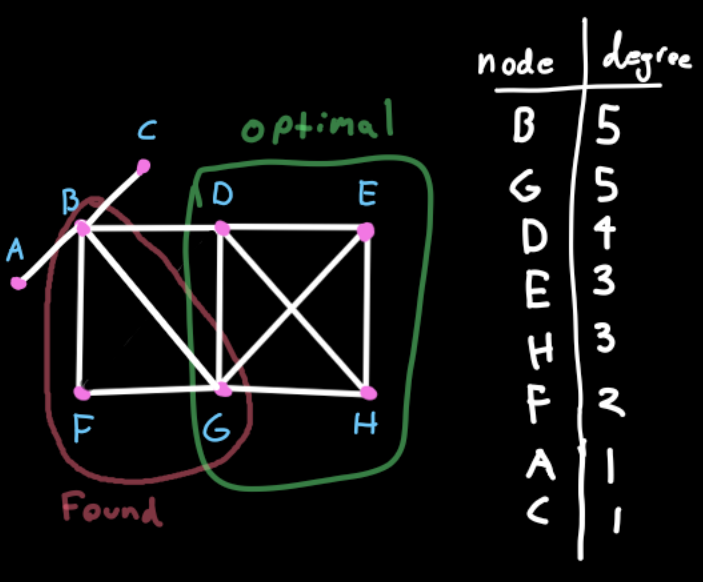
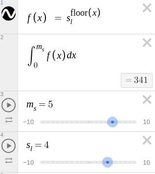

(1) **Show that a + b can be less than min(a, b).**

----

(3) **Design/draw a road network with two points a and b such that the fastest
route between a and b is not the shortest route.**

----

(4) **Design/draw a road network with two points a and b such that the shortest
route between a and b is not the route with the fewest turns.**

----

(5) **The knapsack problem is as follows: given a set of integers S = {s1, s2, . . . , sn},
and a target number T , find a subset of S that adds up exactly to T . For ex-
ample, there exists a subset within S = {1, 2, 5, 9, 10} that adds up to T = 22
but not T = 23. Find counterexamples to each of the following algorithms for the knapsack prob-
lem. That is, give an S and T where the algorithm does not find a solution that
leaves the knapsack completely full, even though a full-knapsack solution exists.**

(a) **Put the elements of S in the knapsack in left to right order if they fit, that is, the first-fit algorithm.**

(b) **Put the elements of S in the knapsack from smallest to largest, that is, the
    best-fit algorithm.**

(c) **Put the elements of S in the knapsack from largest to smallest.**

----

(6) **The set cover problem is as follows: given a set S of subsets S1, . . . , Sm of
the universal set U = {1, ..., n}, find the smallest subset of subsets T ⊆ S such
that ∪ti∈T ti = U . For example, consider the subsets S1 = {1, 3, 5}, S2 = {2, 4},
S3 = {1, 4}, and S4 = {2, 5}. The set cover of {1, . . . , 5} would then be S1 and S2.**

**Find a counterexample for the following algorithm:** 

`Select the largest subset for
the cover, and then delete all its elements from the universal set. Repeat by
adding the subset containing the largest number of uncovered elements until all
are covered.`

(7)  **The maximum clique problem in a graph G = (V, E) asks for the largest
subset C of vertices V such that there is an edge in E between every pair of
vertices in C. Find a counterexample for the following algorithm:**

`Sort the vertices of G from highest to lowest degree. Considering the vertices in order
of degree, for each vertex add it to the clique if it is a neighbor of all vertices
currently in the clique. Repeat until all vertices have been considered.`

----

(22) **How many words are there in this textbook?**

There seems to be about 40 lines per page and an average 12 words per line on a full page with no graphics.

Graphics, figures, and illustrations seem to occupy roughly 40% of all space that would otherwise be occupied with words.

`40 * 12 * (1 - 0.4) = 288 words per page`

My kitchen scale puts a sheet of printer paper at 4.8 grams
The book weighs 1538.7 grams

`Book paper area / Printer paper area = ~0.7`

`(1538 / 4.8) * (1.0 / 0.7) = 457.14 pages`

`288 words per page * 457.14 pages = 131616 words`

----

(24) **Estimate how many cities and towns there are in the United States.**

There seems to be a relationship between size of a community and frequency of community of that size (there are much more small communities than large ones.) If we assume a fractal-like relationship between large communities and smaller communities, maybe we can make a statement that correlates an easier number to guess (the number of major (top-level) cities) with a harder number to guess (the total sum of communities). 

Lets assume:
- A directed tree that models the support structure of a single top-level community.
- The split at each tree level is 4 (a community is directly supported by 4 smaller communities).
- The tree splits 5 times
- Each U.S. State contains an average of 2.5 top level cities

`s_l = splits per level`

`m_s = tree depth`

This integral suggests each top-level city would require the support of 340 cities. (341 including itself)

`50 U.S states * 2.5 Top Level Cities per state * 341 Communities per Top Level City = 42625 towns and cities`

----

(28) 

**(a) Does your RAM memory access a word in more or less than a microsecond?**

CPU speed is typically measured in GHz, the period of which is measured in nanoseconds. A single operation in the CPU cant take place in less than the tick of a clock cycle. It seems likely that microcode operations are well optimized to do simple fundamental operations in very few clock cycles. Lets say 12 clock cycles for the average microcode instruction.

`1 / 2.4Ghz * 12 = 4.992ns per instruction`

RAM access is likely to be engineered to be as efficient as possible but there would still be a signifigant delay. The slowest possible delay would be the time it takes for light to travel round-trip between the RAM and the CPU. It takes light almost exactly 1.0ns to travel a foot which seems the right distance for that round trip. 

If the fastest possible speed we can access the RAM is 1ns and we assume our computer is 10 times slower then that. 

Total RAM fetch speed would be approximately:

`4.992ns + 10 * 1.0ns = 14.992ns`

RAM access speed takes place on the order of nanoseconds.

**(b) Is disk drive access time normally measured in milliseconds (thousandths of
a second) or microseconds (millionths of a second)?**

Assuming hard disk drive fetch speed is about 1000 times worse than RAM, its likely its fetch time is measured in microseconds.

**(c) How many instructions can your CPU execute in one year if the machine is left running all the time?**

Using our prior estimation of `4.992ns per instruction` a single core CPU could do approximately: 

`31536000 seconds per year / 0.000000004992s = ~6317 trillion instructions per year`

----

(32) **Write a function to perform integer division without using either the / or *
operators. Find a fast way to do it.**

See divide.js
