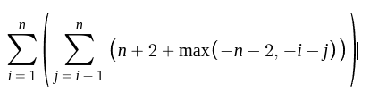
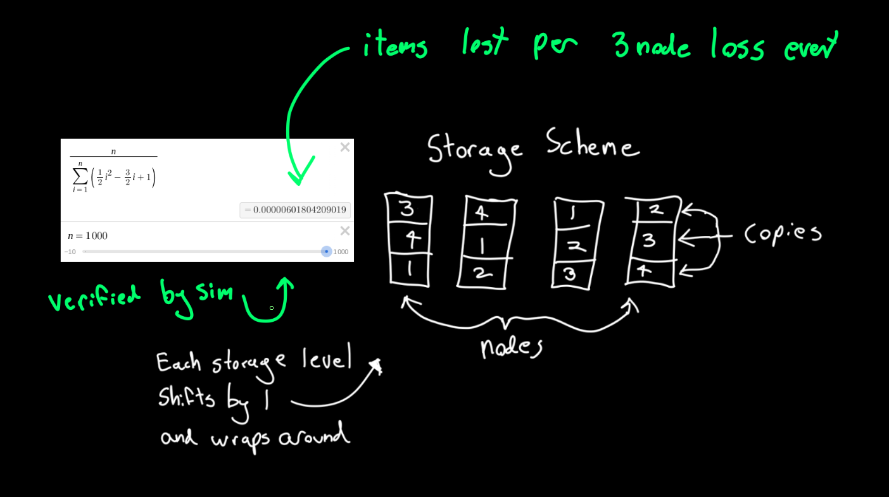

(1) 
**What value is returned by the following function? Express your answer as
a function of n. Give the worst-case running time using the Big Oh notation.**

```
Mystery(n)
    r = 0
    for i = 1 to n − 1 do
        for j = i + 1 to n do
            for k = 1 to j do
                r = r + 1
    return(r)
```


___
(2) 
**What value is returned by the following function? Express your answer as
a function of n. Give the worst-case running time using Big Oh notation.**

```
Pesky(n)
    r = 0
    for i = 1 to n do
        for j = 1 to i do
            for k = j to i + j do
                r = r + 1
    return(r)
```


___
(3) 
**What value is returned by the following function? Express your answer as
a function of n. Give the worst-case running time using Big Oh notation.**

```
Pestiferous(n)
    r = 0
    for i = 1 to n do
        for j = 1 to i do
            for k = j to i + j do
                for l = 1 to i + j − k do
                    r = r + 1
    return(r)
```


___
(4) 
**What value is returned by the following function? Express your answer as
a function of n. Give the worst-case running time using Big Oh notation.**

```
Conundrum(n)
    r = 0
    for i = 1 to n do
        for j = i + 1 to n do
            for k = i + j − 1 to n doe
                r = r + 1
    return(r)
```




**Blue**: Summation equation

**Red**: (1/10)x^3


Many summation symbol properties break when its possible for n to be negative. This makes it difficult to arrive at a closed form solution.
The loop is at the very least O(n^2), and is almost certainly O(n^3). 

O(n^3) is consistent with multiplication of the time complexity of the functions 3 loops

A: O(Conundrum(n)) = O(OuterLoop(n)) * O(MiddleLoop(n)) * O(InnerLoop(n)) = O(n) * O(n-1) * O(n) = **O(n^3)**

___
(5) 
**Consider the following algorithm: (the print operation prints a single aster-
isk; the operation x = 2x doubles the value of the variable x).**

```
for k = 1 to n:
    x = k
    while (x < n): 
        print ’*’
        x = 2x
```

**Let f (n) be the time complexity of this algorithm (or equivalently the number
of times * is printed). Provide correct bounds for O(f (n)) and Ω(f (n)), ideally
converging on Θ(f (n)).**


The inner section of this function is logically equivalent to 
```
for k = 1 to n:
    let g = The number of times k could double before it exceeded n
    for k = 1 to g:
        print ’*’
```

The notion of 'k doublings' is related to 2^x  

k2^x = n
2^x = n/k

log_2(n/k) = x

ceiling(Math.log2(n/k))

While the ceiling operator makes this fully accurate, it would be easier to analyze things continuously. I'm adding 1/2 to account for the ceiling function on average moving things up by 1/2.


```
for k = 1 to n:
    for g = 1 to Math.log2(n/k) + 1/2
        print ’*’
```


The function is well defined enough for a tight bound.


___
(6) 

**Suppose the following algorithm is used to evaluate the polynomial**

```
p(x) = anxn + an−1xn−1 + . . . + a1x + a0
```
```
p = a0;
xpower = 1;
for i = 1 to n do
    xpower = x · xpower;
    p = p + ai ∗ xpower
```
(a)
**How many multiplications are done in the worst case? How many additions?**

2n multiplications

1n additions

(b)
**How many multiplications are done on the average?**

The loop is guaranteed to run n times and contains two multiplications.

Exactly 2n.

(c)
**Can you improve this algorithm?**
```
// Runs highest order terms to lowest.
function polynomialEvaluation(inputTerms, x) {
    let total = 0;

    for (let i = 0; i < inputTerms.length; i++) {
        total = total + inputTerms[i];
        total = total * x;
    }

    return total;
}
``` 

n multiplications

n additions
___
(15) 
**Suppose you have algorithms with the five running times listed below. (As-
sume these are the exact running times.) How much slower do each of these
algorithms get when you (a) double the input size, or (b) increase the input size
by one?**


(answers are `extra operations = new number of operations - original number of operations`)

We need to recheck. We made a blunder with adding +1 to powers

(a) Double: `3n^2` Add one: `2n + 1`

(b) Double: `7n^3` Add one: `3n^2 + 3n + 1`

(c) Double: `300n^2` Add one: `200n + 100`

(d) Double: `nlog(4n)` Add one: `nlog(1 + 1/n) + log(n + 1)`

(e) Double: `(2^n)^2 - 2^n` Add one: `2^n`
___
(16)
**Suppose you have algorithms with the six running times listed below. (Assume these are the exact number of operations performed as a function of the
input size n.) Suppose you have a computer that can perform 10^10 operations
per second. For each algorithm, what is the largest input size n that you can
complete within an hour?**


`ω = 36,000,000,000,000 operations per hour = 10^10 operations per second * 60 seconds * 60 minutes`


(a) n = sqrt(ω) = 6000000

(b) n = cbrt(ω) = 33019

(c) n = sqrt(ω/100) = 600000

(d) n = (ω/productLog(ω)) = approx. 1.29 * 10^12 

(e) n = log2(ω) = approx. 45.03

(f) n = log2(log2(ω)) approx. 5.49

___
(30)
**For each of these questions, answer yes or no and briefly explain your answer.**
(a) If an algorithm takes O(n^2) worst-case time, is it possible that it takes O(n)
on some inputs?

Yes.
```
    function a(input) {
        if (input === 7) {
            // Take o(n)
        } else {
            // Take o(n^2)
        }
        return
    }
```


(b) **If an algorithm takes O(n^2) worst-case time, is it possible that it takes O(n)
on all inputs?**

No. An algorithm that is O(n) on all inputs can never be O(n^2).

(c) **If an algorithm takes Θ(n^2) worst-case time, is it possible that it takes O(n)
on some inputs?**

Technically yes. While Θ(n^2) implies a tight bound on the function modified only by constants, this is true only past the value n_0. Inputs before n_0 could be O(n).

(d) **If an algorithm takes Θ(n^2) worst-case time, is it possible that it takes O(n)
on all inputs?**

No. An algorithm that is O(n) on all inputs can never be Θ(n^2).

(e) **Is the function f (n) = Θ(n^2), where f (n) = 100n^2 for even n and f(n) =
20n^2 − n log2 n for odd n?**

The function is equal to O(n^2) but not Θ(n^2). While the primary term in the odd scenario is n^2 the non constant terms mean the function as a whole is not tightly bound.
The function is O(n^2)
___
(37)

**Find an expression for the sum of the ith row of the following triangle, and
prove its correctness. Each entry is the sum of the three entries directly above
it. All non-existing entries are considered 0.**


Every single cell is sampled and added to the next levels sum exactly 3 times.

Therefore, every single 'unit' of value on one level has to feature on the following level exactly 3 times.

Sum of row = 3 ^ (row level)

___
(49)

**(We have 1,000 data items to store on 1,000 nodes. Each node can store copies
of exactly three different items. Propose a replication scheme to minimize data
loss as nodes fail. What is the expected number of data entries that get lost
when three random nodes fail?)**



The important property of this storage scheme is any copy is the only copy of that data item on any given node. Assuming the copies are in order (they needn't be) the odds of us losing a single copy is essentially equivalent to: What are the odds that all 3 random nodes chosen are nextdoor neighbours (all three nodes contain copies of the same item)? The formula featured calculates the expected number of lost data items for 3 node failures (this is well below 1).
___
(50)

**Consider the following algorithm to find the minimum element in an array
of numbers A[0, . . . , n]. One extra variable tmp is allocated to hold the current
minimum value. Start from A[0]; tmp is compared against A[1], A[2], . . . , A[N ]
in order. When A[i] < tmp, tmp = A[i]. What is the expected number of times
that the assignment operation tmp = A[i] is performed?**


Every time we evaluate an item of A the chances increase that we have already found the minimum value.
___
(53)

**Suppose we start with n companies that eventually merge into one big company. How many different ways are there for them to merge?**


